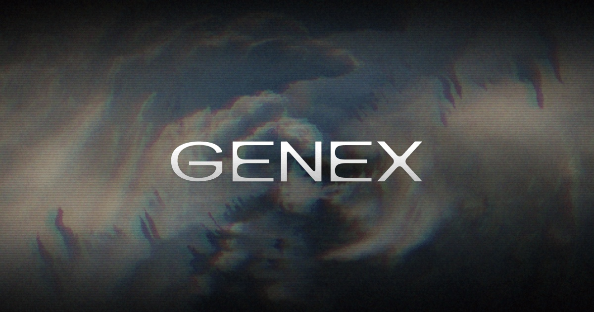

<p align="center">
  
</p>

<h1 align="center">Genex: your personal AI game dev studio</h1>

<p align="center">
  The best game dev tools in one place: 3D models, animations, textures, sound, music, multiplayer and publishing.<br>
  Use them with any AI agent or in the browser.
</p>

<p align="center">
  <a href="https://genex.games">genex.games</a> ·
  <a href="https://genex.games/tools">Tools</a> ·
  <a href="https://genex.games/docs">Docs</a> ·
  <a href="https://www.npmjs.com/package/@genex-ai/cli-demo">npm</a>
</p>

## Give this to your agent

Paste one line into Claude Code, Codex, Cursor, Hermes or any agent that reads a `SKILL.md`:

```
set up https://genex.games/SKILL.md and let it take it from there
```

The agent installs the Genex skill into your project, signs you in once in the browser, and from then on generates 3D models, characters, animations, textures, images, video, sound effects, music and voice from the terminal. The files land in your project. Your code stays yours.

## What is in this repository

| Path | What it is |
| --- | --- |
| [`skills/genex/SKILL.md`](skills/genex/SKILL.md) | The Genex skill, byte-identical to the one served at [genex.games/SKILL.md](https://genex.games/SKILL.md). Mirrored automatically from the product on every release; not edited here. |
| [`.claude-plugin/`](.claude-plugin/) | The Claude Code plugin marketplace manifest, so `/plugin marketplace add genex-games/genex` works. |
| [`assets/`](assets/) | The wordmark, the mark and the share card. |

## Install by directory

- **Claude Code plugin:** `/plugin marketplace add genex-games/genex`, then `/plugin install genex@genex`.
- **skills CLI:** `npx skills add genex-games/genex`.
- **Any other agent:** copy [`skills/genex/SKILL.md`](skills/genex/SKILL.md) into your project's skills folder, or just paste the setup line above.

## How Genex works

Genex is not an editor. Your game is a normal three.js project in a repository you control, built by the coding agent you already use. Genex is the layer of superpowers attached to it:

- **Assets.** Every game dev generation tool behind one sign-in and one balance. Pay per generation, no subscriptions, refunds on failure. Prices are on [genex.games/tools](https://genex.games/tools).
- **Multiplayer.** A typed SDK ([`@genex-ai/multiplayer`](https://www.npmjs.com/package/@genex-ai/multiplayer)) with shared state, object ownership, host election, text and voice chat, against a hosted relay.
- **Publishing.** `genex publish` puts the game live at its own address in seconds, playable on any phone, with a remix button for anyone who wants to build on it.
- **Players.** Every player gets an identity with zero clicks ([`@genex-ai/embed-sdk`](https://www.npmjs.com/package/@genex-ai/embed-sdk)).

Full documentation, including the CLI and HTTP API reference: [genex.games/docs](https://genex.games/docs). An agent-readable index of every docs page: [genex.games/docs/llms.txt](https://genex.games/docs/llms.txt).

## Questions and problems

Open an issue here. For anything about your account, write to team@genex.games.
